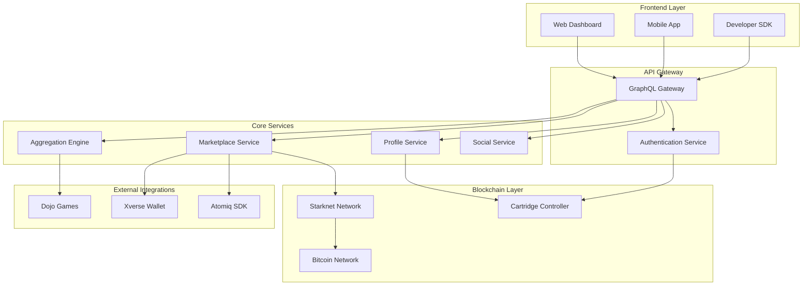

# Design Document

## Overview

The Universal On-Chain Gaming Hub is a comprehensive platform that serves as the central aggregation point for Starknet-based gaming ecosystems. The system consists of multiple interconnected components: a data aggregation engine, unified identity management, a Bitcoin-integrated marketplace, and developer tools for seamless integration.

The platform leverages Cartridge Controller for identity management, Cairo smart contracts for marketplace operations, and integrates Bitcoin payments through Xverse wallet and Atomiq SDK for cross-chain liquidity.

## Architecture

### High-Level Architecture



### Component Architecture

The system follows a microservices architecture with clear separation of concerns:

1. **Frontend Layer**: User interfaces and developer tools
2. **API Gateway**: Centralized entry point with authentication
3. **Core Services**: Business logic microservices
4. **Blockchain Layer**: On-chain interactions and smart contracts
5. **External Integrations**: Third-party services and game connections

## Components and Interfaces

### 1. Aggregation Engine

**Purpose**: Normalizes and aggregates data from multiple Dojo games into standardized formats.

**Key Interfaces**:
```typescript
interface GameAdapter {
  gameId: string;
  normalize(rawData: any): StandardizedGameData;
  fetchPlayerData(playerId: string): Promise<PlayerGameData>;
  subscribeToUpdates(callback: (data: PlayerGameData) => void): void;
}

interface StandardizedGameData {
  playerId: string;
  gameId: string;
  assets: GameAsset[];
  achievements: Achievement[];
  statistics: GameStatistics;
  lastUpdated: timestamp;
}
```

**Implementation Details**:
- Plugin-based adapter system for different Dojo games
- Real-time data synchronization using WebSocket connections
- Caching layer with Redis for performance optimization
- Event-driven architecture for data updates

### 2. Profile Service

**Purpose**: Manages unified player identities and cross-game profiles.

**Key Interfaces**:
```typescript
interface UnifiedProfile {
  playerId: string;
  cartridgeId: string;
  displayName: string;
  avatar: string;
  totalAchievements: number;
  crossGameAssets: CrossGameAsset[];
  socialSettings: SocialSettings;
  createdAt: timestamp;
}

interface ProfileService {
  createProfile(cartridgeId: string): Promise<UnifiedProfile>;
  getProfile(playerId: string): Promise<UnifiedProfile>;
  updateProfile(playerId: string, updates: Partial<UnifiedProfile>): Promise<void>;
  aggregateGameData(playerId: string): Promise<AggregatedData>;
}
```

### 3. Marketplace Service

**Purpose**: Handles asset trading with Bitcoin integration and cross-chain swaps.

**Key Interfaces**:
```typescript
interface MarketplaceListing {
  listingId: string;
  sellerId: string;
  asset: GameAsset;
  priceInBTC: number;
  priceInStarknet?: number;
  status: ListingStatus;
  createdAt: timestamp;
}

interface MarketplaceService {
  createListing(asset: GameAsset, priceInBTC: number): Promise<string>;
  purchaseWithBTC(listingId: string, buyerWallet: string): Promise<Transaction>;
  executeSwap(btcAmount: number, targetAsset: string): Promise<SwapResult>;
}
```

### 4. Social Service

**Purpose**: Manages social features, friend lists, and community interactions.

**Key Interfaces**:
```typescript
interface SocialService {
  addFriend(playerId: string, friendId: string): Promise<void>;
  getFriends(playerId: string): Promise<UnifiedProfile[]>;
  searchPlayers(query: string): Promise<UnifiedProfile[]>;
  createCommunityQuest(quest: CommunityQuest): Promise<string>;
}
```

## Data Models

### Core Data Models

```typescript
// Player Identity
interface Player {
  id: string;
  cartridgeId: string;
  walletAddress: string;
  profile: UnifiedProfile;
  gameProfiles: GameProfile[];
  socialConnections: SocialConnection[];
}

// Game Assets
interface GameAsset {
  id: string;
  gameId: string;
  tokenId: string;
  contractAddress: string;
  assetType: 'NFT' | 'CURRENCY' | 'ITEM';
  metadata: AssetMetadata;
  owner: string;
  tradeable: boolean;
}

// Achievements
interface Achievement {
  id: string;
  gameId: string;
  playerId: string;
  achievementType: string;
  title: string;
  description: string;
  rarity: 'COMMON' | 'RARE' | 'EPIC' | 'LEGENDARY';
  earnedAt: timestamp;
  nftBadgeId?: string;
}

// Marketplace Transactions
interface Transaction {
  id: string;
  type: 'BUY' | 'SELL' | 'SWAP';
  buyerId: string;
  sellerId: string;
  asset: GameAsset;
  btcAmount: number;
  starknetAmount?: number;
  status: TransactionStatus;
  txHash: string;
  createdAt: timestamp;
}
```

### Smart Contract Models (Cairo)

```cairo
// Marketplace Contract
#[starknet::contract]
mod UniversalMarketplace {
    struct Listing {
        listing_id: u256,
        seller: ContractAddress,
        asset_contract: ContractAddress,
        token_id: u256,
        price_btc: u256,
        active: bool,
    }
    
    struct Transaction {
        tx_id: u256,
        buyer: ContractAddress,
        seller: ContractAddress,
        asset_contract: ContractAddress,
        token_id: u256,
        amount_paid: u256,
        completed: bool,
    }
}

// Achievement Badge Contract
#[starknet::contract]
mod AchievementBadges {
    struct Badge {
        badge_id: u256,
        player: ContractAddress,
        game_id: felt252,
        achievement_type: felt252,
        rarity: u8,
        minted_at: u64,
    }
}
```

## Error Handling

### Error Categories

1. **Network Errors**: Blockchain connectivity, API timeouts
2. **Authentication Errors**: Invalid Cartridge credentials, expired sessions
3. **Data Integrity Errors**: Corrupted game data, invalid asset transfers
4. **Business Logic Errors**: Insufficient funds, asset not tradeable
5. **External Service Errors**: Xverse wallet issues, Atomiq swap failures

### Error Handling Strategy

```typescript
interface ErrorHandler {
  handleNetworkError(error: NetworkError): Promise<RetryResult>;
  handleAuthError(error: AuthError): Promise<void>;
  handleDataError(error: DataError): Promise<RecoveryResult>;
  handleBusinessError(error: BusinessError): UserFriendlyError;
}

// Retry mechanisms with exponential backoff
class RetryManager {
  async executeWithRetry<T>(
    operation: () => Promise<T>,
    maxRetries: number = 3,
    backoffMs: number = 1000
  ): Promise<T>;
}

// Circuit breaker for external services
class CircuitBreaker {
  async call<T>(service: string, operation: () => Promise<T>): Promise<T>;
}
```

### Recovery Mechanisms

- **Data Recovery**: Restore from verified on-chain sources within 1 hour
- **Transaction Recovery**: Automatic refund mechanisms for failed BTC transactions
- **Service Recovery**: Graceful degradation with cached data during outages
- **State Recovery**: Event sourcing for complete system state reconstruction

## Testing Strategy

### Unit Testing

- **Coverage Target**: 90% code coverage for all core services
- **Framework**: Jest for TypeScript services, Cairo test framework for smart contracts
- **Mock Strategy**: Mock external dependencies (Xverse, Atomiq, Dojo games)

### Integration Testing

- **API Testing**: GraphQL endpoint testing with real database connections
- **Blockchain Testing**: Starknet testnet integration for smart contract interactions
- **Cross-Service Testing**: End-to-end workflows across microservices

### End-to-End Testing

- **User Journey Testing**: Complete player registration to asset trading workflows
- **Performance Testing**: Load testing with simulated concurrent users
- **Security Testing**: Penetration testing for wallet integrations and asset transfers

### Test Environments

1. **Local Development**: Docker-compose with local blockchain nodes
2. **Staging**: Starknet testnet with production-like data volumes
3. **Production**: Mainnet with comprehensive monitoring and alerting

### Automated Testing Pipeline

```yaml
# CI/CD Pipeline Structure
stages:
  - unit_tests
  - integration_tests
  - security_scans
  - performance_tests
  - deployment_staging
  - e2e_tests
  - deployment_production
```

### Testing Data Management

- **Test Data Generation**: Automated creation of realistic game data and player profiles
- **Data Isolation**: Separate test databases for each test suite
- **Cleanup Strategy**: Automatic cleanup of test data after test completion
- **Snapshot Testing**: UI component snapshot testing for consistent rendering